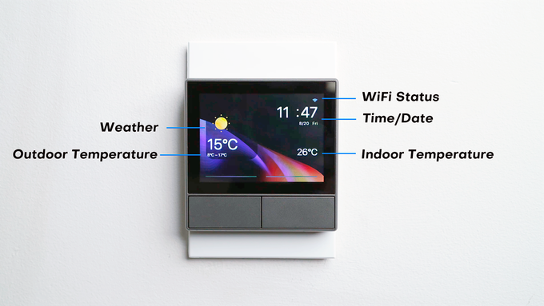
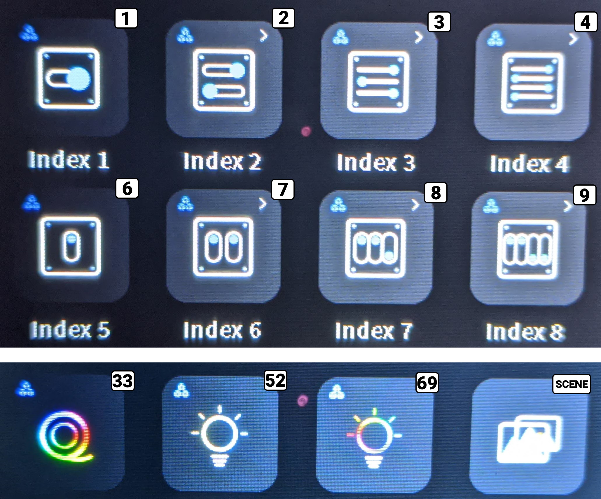

# NSPanel Protocol 
```
55 AA [type] [payload length] [00] [JSON payload] [crc] [crc]
```

[What is JSON?](JSON: What It Is, How It Works, & How to Use It)

## Utility commands

| JSON Payload | Action and options<BR>`%b` = binary choice 0 or 1,`%d` = number, `%s` = string                | Notes         | Type |
|--------------|------------------------------|---|------|
| `{"queryInfo":"version"}`| Query screen version                  |     | 80   |
| `{"queryInfo":"factory"}`| Enter factory test mode               |     | 80   |
| `{"HMI_dimOpen":%b}`     | Set Energy-saving mode<BR>`0` = screen always on<BR>`1` = screen off        |     | 87   |

## Main Page

| JSON Payload | Action and options<BR>`%b` = 0 or 1,`%d` = number, `%s` = string                | Notes         | Type |
|------------|------------------------------|---|------|
| `{"wifiState":"%s","rssiLevel":%d}` | Set wifi icon<BR>`%s` = connecting; disconnect; pairing; nonetwork<BR>RssiLevel `%d` = 0 – 4         | if using higher number draws other picture resources    | 85   |
| `{"temperature":%d,"humidity":%d,"tempUnit":%d}` | Set room temperature<BR>temperature `%d` = up to 5 characters, decimals are ignored but can be in the parameter       | humidity isn't displayed<BR>temperature can be up to 5 characters<B>5th character overwrites the unit | 83   |
| `{"tempUnit":%b}`        | Set displayed temperature unit<BR>`0` = °C<BR>`1` = °F   |     | 83   |
| `{"year":1970,"mon":1,"day":1,"hour":2,"min":0,"week":4}`<BR>`{"year":2021,"mon":10,"day":12,"hour":23,"min":22,"week":2}` | `week` is weekday, the rest is obvious | Every entry must respect the range for its type, f.e. month cannot be higher than 12 | 82   |

### Show relays status

Typical payload
```json
{"switches":[{"outlet":1,"switch":"on"}]}
```

| JSON Payload | Action and options<BR>`%b` = 0 or 1,`%d` = number, `%s` = string                | Notes         | Type |
|------------|------------------------------|---|------|
| `"outlet":%b` | Choose relay<BR>&emsp;`0` = Relay1<BR>&emsp;`1` = Relay2   | | 87 |
| `"switch":"%s"` | Set status on main page<BR>`%S` = `on` or `off`          | | 87 |

You can combine both messages as one payload: `{"switches":[{"switch":"off","outlet":0},{"switch":"on","outlet":1}]}`

### Set weather forecast display

Typical payload
```json
{"HMI_weather":7,"HMI_outdoorTemp":{"current":5,"range":"-3,8"}}
```
  
| Key | Action and options<BR>`%b` = 0 or 1,`%d` = number, `%s` = string                | Notes         | Type |
|------------|------------------------------|---|------|
|   `"HMI_weather":%d`      | 1   =   sunny   <BR>2   =   sun+cloud   <BR>7   =   cloud+blue cloud    <BR>11  =   cloud+fog <BR>15  =   cloud rain lightning    <BR>20  =   cloud+snowflake <BR>22  =   cloud + 3 snowflakes    <BR>22  =   cloud + 5 ice crystals  <BR>22  =   cloud + rain + snow <BR>30  =   red thermostat  <BR>31  =   blue thermostat <BR>32  =   wind    <BR>40  =   rainy cloud <BR> | Icons repeat under different numbers. When using a non-existing number Nextion returns `{"error":2}` | 81   |
|   `"HMI_outdoorTemp":%d`      | `%d` = Set outdoor temperature | 5 characters max, 5th character overwrites the unit on the display | 81   |
|   `"range":"%s"`      | `%s` = set temperature range using comma separated values, 5 characters max (example: `-3,8`)  | Range string can be anything but the display will still show °C/°F after each entry                         | 81   |



## Thermostat Page
### Thermostat screen control

Typical payloads
```json
{"ATCEnable":0,"ATCMode":0,"ATCExpect0":27}
{"ATCMode":1,"ATCExpect1":29}
{"ATCEnable":1}
```  
  
| Key | Action and options<BR>`%b` = 0 or 1,`%d` = number, `%s` = string                | Notes         | Type |
|------------|------------------------------|---|------|
| `"ATCEnable":%b`       | Thermostat screen toggle<BR>`0` = off<BR>`1` = off | Same payload is received when using the toggle on the screen | 84   |
| `"ATCMode":%b`         | Thermostat screen mode icons<BR>`0` = manual<BR>`1` = auto | Same payload is received when using the toggle on the screen | 84   |
| `"ATCExpect0":%d`      | Thermostat screen temperature for manual mode | Same payload is received when using the toggle on the screen      | 84   |
| `"ATCExpect1":%d`      | Thermostat screen temperature for auto mode | Same payload is received when using the toggle on the screen        | 84   |
  
### Activate thermostat page

Original payload to activate thermostat screen
```json
{"HMI_ATCDevice":{"ctype":"device","id":"1001383218","outlet":0,"etype":"hot"}}
```
  
| Key | Action and options<BR>`%b` = 0 or 1,`%d` = number, `%s` = string                | Notes        | Type |
|------------|------------------------------|---|------|
| `"id":"%s"` | `%s` = identification string |  If the id is identical to a widget id the internal script will control the chosen outlet        | 84 |
| `"outlet":%b` | `%b` = relay used to control thermostat<BR>&emsp;`0` = Relay1<BR>&emsp;`1` = Relay2 | Does not matter without original firmware| 84 |
| `"etype":"%s"` | `%s` = `hot` or `cold` | Draws different icon on the page                                | 84 |
  
On success Nextion returns `{"ctype":"device","id":"%s","resourcetype":"ATC"}`.

When in Auto mode the thermostat logic is coded in the screen itself and will send messages to activate the outlet # of a switch with the same "id": `{"id":"1000f71b01","params":{"switch":"on","switches":[{"switch":"on","outlet":1}]}}}`

In original firmware the "id" is the NSPanel's one but you can set the "id" to a switch widget one. In that case you can mirror the message received from thermostat and control the switch widget.

## Widgets

### Draw widgets

Typical payloads
```json
{"HMI_resources":[{"index":1,"ctype":"device","id":"1000f71b01","uiid":103}]}
{"HMI_resources":[{"index":2,"ctype":"group","id":"1000f190e6","uiid":103}]}
{"HMI_resources":[{"index":4,"ctype":"scene","id":"6164676632647f2a6d593cf2"}]}
{"index":7,"type":"delete"}
```

| Key | Action and options<BR>`%b` = 0 or 1,`%d` = number, `%s` = string                | Notes        | Type |
|------------|------------------------------|---|------|
| `"index":%d` | Set position of widget<BR>`1` to `8` counting from top left to right |                                                            | 86 |
| `"ctype":"%s"` | Set type of widget<BR>&emsp;`device` = basic widget tracks online and offline status<BR>&emsp;`group` = same as device but always online<BR>&emsp;`scene` = trigger immediately, has no submenu | | 86 |
| `"id":%s` | Used to identify the widget from other commands. Can be same as index number | | 86 |
| `"uiid":%d` | Determines which icon and which subpage is used<BR>1 = toggle switch horizontal<BR>2 = toggle switch double horizontal<BR>3 = toggle switch triple horizontal<BR>4 = toggle switch quad horizontal<BR>6 = toggle switch vertical<BR>7 = toggle switch double vertical<BR>8 = toggle switch triple vertical<BR>9 = toggle switch quad vertical<BR>33 = RGB light strip<BR>52 = CCT bulb<BR>69 = RGB+CCT bulb<BR> | Scenes do not have uiid      | 86 |
| `"type":"delete"` | Delete widget at "index" |       | 86 |

When initially drawing widgets you need to send commands for all 8 indexes, if you want to keep an index empty send a delete command for that index.



### Set widget status

```json
{"relation":[{"ctype":"device","id":"1001383218","name":"NSPane..","online":true,"params":{"switches":[{"switch":"off","outlet":0},{"switch":"off","outlet":1}]}}]}
{"relation":[{"ctype":"device","id":"1000f190e6","params":{"switch":"off","ltype":"white","white":{"br":42,"ct":96}},"name":"Bulb A..","online":true}]}
{"relation":[{"ctype":"device","id":"1001382a6f","params":{"switch":"off","colorR":248,"colorG":0,"colorB":240,"mode":1,"bright":40,"light_type":1},"name":"L2","online":false}]}
{"relation":[{"ctype":"group","id":"1000f190e6","params":{"switches":[{"switch":"off","outlet":0},{"switch":"off","outlet":1},{"switch":"on","outlet":2},{"switch":"on","outlet":3}]}}]}
{"relation":[{"ctype":"scene","id":"6164676632647f2a6d593cf2","name":"Scene"}]}
```

| Key | Action and options<BR>`%b` = 0 or 1,`%d` = number, `%s` = string                | Notes        | Type |
|------------|------------------------------|---|------|
| `"ctype":"%s"` | Identical to the "ctype" used when drawing the widget  | | 86 |
| `"id":%s` | Identical to the "id" used when drawing the widget | | 86 |
| `"params":` | Parameters of the widget, different for each widget | When you use the widget you receive all the available parameters in the same payload | 86 |
| `"name":"%s"` | Name for the widget icon. 8 characters max, rest will not be visible | Depending on which characters are used it can fit 9 characters | 86 |
| `"online":%bool` | Online status of the widget<BR>`%b` = `true` or `false` | Groups do not have online status | 86 |

Scenes only use id and name.

You can omit "relation:" key from the payload and use its value only: `{"ctype":"group","id":"1","params":{"switch":"off","switches":[{"switch":"off","outlet":0}]}}`